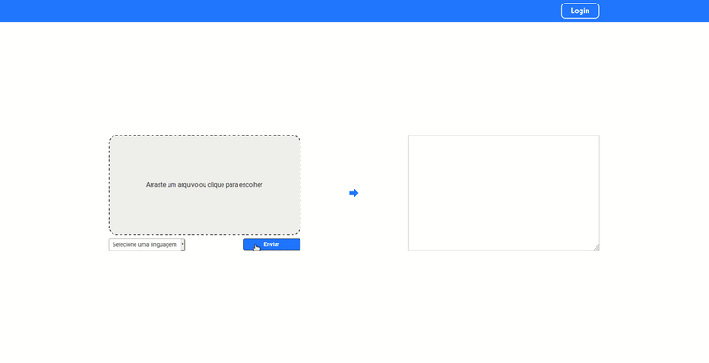

# Demonstração

# Conversor de imagens em texto
Todos os dias milhares de pessoas necessitam extrair um texto de alguma imagem e a maioria das interfaces de conversão são muito poluídas. Então desenvolvemos uma solução para nossos clientes. Um coversor de imagem em texto muito amigável ao usuário.

# Como executar o projeto

Tenha instalado o [NODEJS](https://nodejs.org/en/)

Tenha instalado o [YARN](https://yarnpkg.com/getting-started/install)

Clone este repositório
<pre>git clone https://github.com/MiguelBragaGarcia/Image-to-Text-Converter.git</pre>

Siga as demais instruções que estão em suas respectivas pastas.

